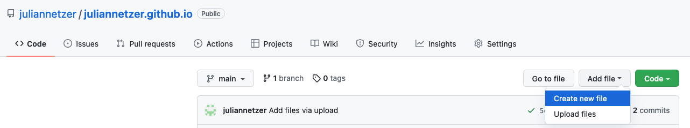
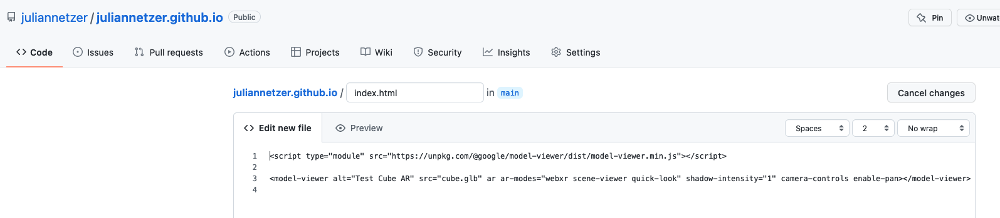
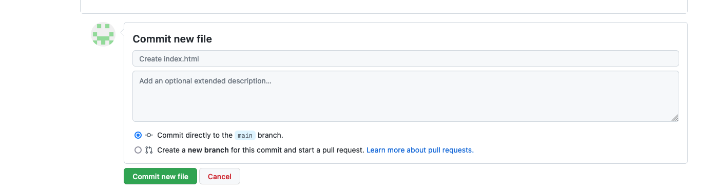
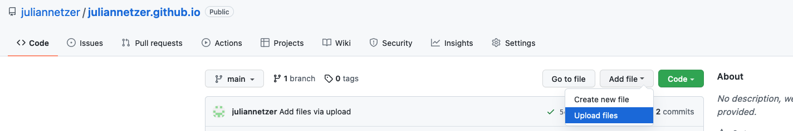

# WebAR with google model viewer

Creates a simple AR Web Application for prototyping. 

## Create github account: 

https://github.com/

## Create your github page: 

### 1. Follow: https://docs.github.com/en/pages/quickstart (Skip steps 4-6)

### 2. Create index.html file in your repository:




Add the following code: 
```
<script type="module" src="https://unpkg.com/@google/model-viewer/dist/model-viewer.min.js"></script>

<model-viewer alt="AR Prototype" src="name_of_your_3d_model.glb" ar ar-modes="webxr scene-viewer quick-look" shadow-intensity="1" camera-controls enable-pan></model-viewer>
```


### 3. Upload your glb file to the repository: 

### 4. When you visit 

username.github.io

on your phone you should be able to use your model in augmented reality. (takes up to 20 minutes) 

